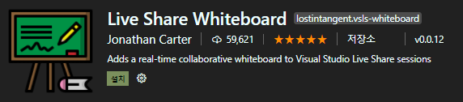
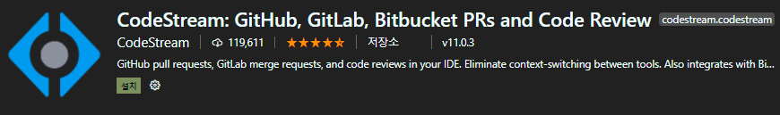

# VS Code

### 1. VS Code Collaborate Tools

---

**_Collaborate Tools은 설치는 꼭 수행해주시기 바랍니다._**

> 스터디를 위한 VS Code에서 필요한 환경 설정입니다.  
> 참조링크는 [다음](https://dev.to/dheyson_alvess/5-essential-visual-studio-code-extensions-for-collaborative-work-59ba)과 같습니다.

- Live Share Extension Pack

  - VS Code에서 화면공유를 위해 사용됩니다.  
    

- Live Share Whiteboard

  - board형식으로 다른 스터디 인원에게 설명하기 위해 사용됩니다.  
    

- Code Stream : GitHub, GitLab, Bitbucket PRs and Code Review
  - 코드에 대한 이슈 및 논의를 스터디 인원에게 공유되며, 해당 코드에 대한 질의응답 수행이 가능합니다.  
    
